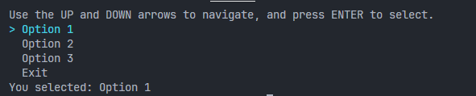

# TextMenuModule

**TextMenuModule** is a PowerShell module that provides a text-based menu interface with arrow key navigation. This module allows users to navigate through menu options using the up and down arrow keys and select an option by pressing Enter.

## Features

- Arrow key navigation to select from different options in a menu.
- Simple, text-based user interface in the PowerShell console.
- Customizable options, allowing you to pass any list of strings for selection.

## Example



## Installation

1. Clone or download this repository.
2. Save `TextMenuModule.psm1` in a folder named `TextMenuModule` under your PowerShell modules directory:

   ```plaintext
   C:\Users\<YourUsername>\Documents\PowerShell\Modules\TextMenuModule\TextMenuModule.psm1
